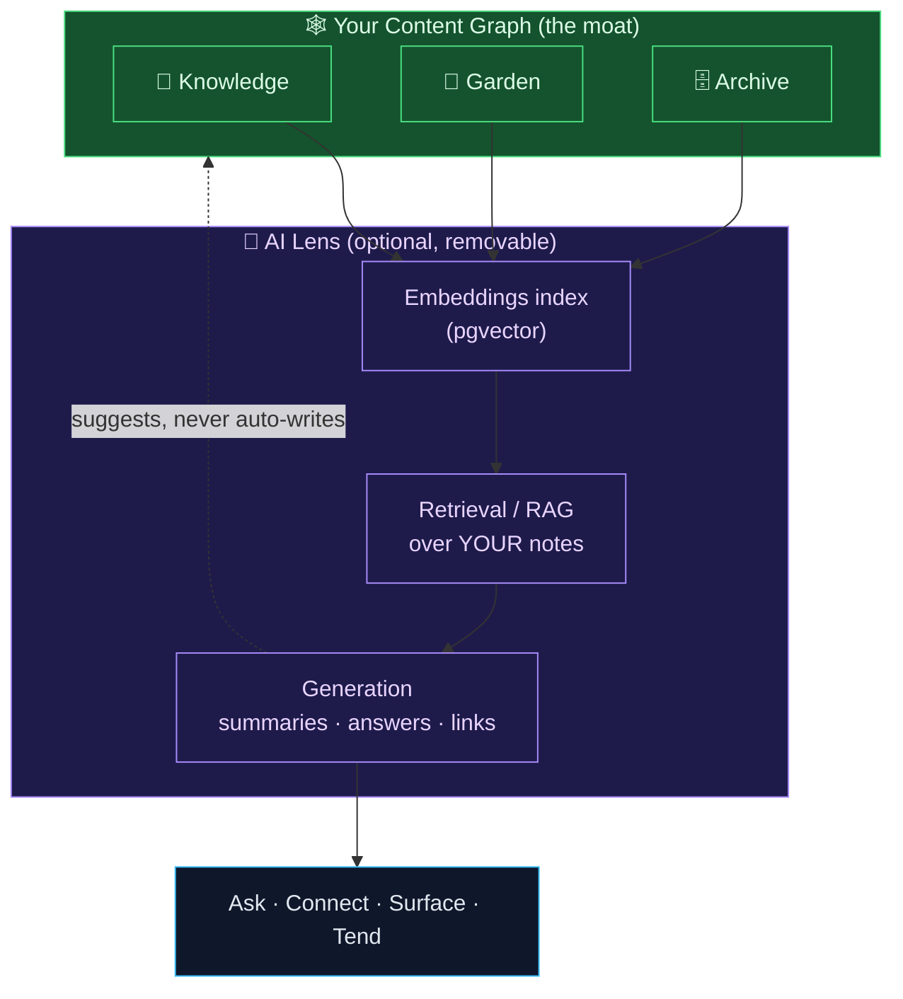
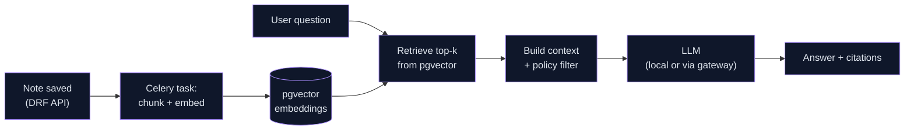
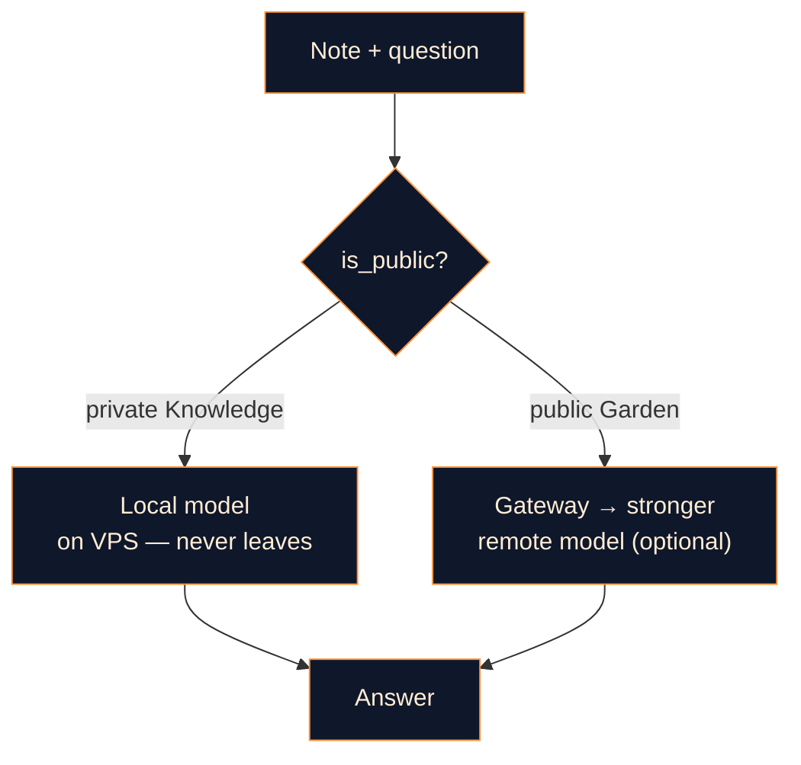
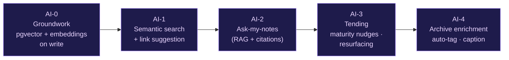

# Technical Section — AI as a Future Layer
### How AI Makes Personal Knowledge · Digital Garden · Personal Archive Better Over Time

> **Framing first.** AI is **not the foundation of this project — it's the payoff layer.** The whole proposal argued that content systems die from disuse, and that discovery features only sparkle once a real corpus exists. The same logic applies here, doubly: AI on an empty knowledge base is a party trick; AI on *years of your own interlinked notes* is a second brain. So everything below is sequenced to arrive **after** content exists, and is designed so that switching AI off leaves the system fully functional. AI augments the graph; it never owns it.

---

## 1. The core idea — your content graph IS the AI's context

Most "AI features" bolt a generic chatbot onto a product. That's the wrong move here. The strategic insight is:

> **You are quietly building, note by note, the single most valuable thing an AI can have — a large, personal, densely-interlinked, *true-to-you* corpus.** The `[[wikilinks]]`, the maturity states, the provenance dates — all the structure you create for your own benefit is *also* the perfect retrieval scaffold for AI.

This means the AI layer isn't a separate feature; it's a **lens over the graph you already own.** It reads your notes, respects the three editorial policies, and gives back understanding — without your content ever leaving your control.

---

## 2. What AI actually adds — concrete capabilities, ranked by value

Not "AI magic" — specific features, each tied to a real friction in a personal knowledge system.

| Capability | What it does | Why it matters here |
|---|---|---|
| **Ask-my-notes (RAG)** | Natural-language questions answered *only* from your corpus, with citations back to the source notes | Turns a pile of notes into a queryable second brain. The single highest-value feature. |
| **Link suggestion** | On save, surfaces existing notes this one *should* connect to | Fights the #1 garden problem: orphan notes. AI proposes `[[wikilinks]]` you'd have missed. |
| **Auto-summary / TL;DR** | Generates a one-line distillation for long notes and archive entries | Improves scannability and feeds better SEO meta descriptions. |
| **Maturity nudges** | Flags seedlings 🌱 that have grown enough to promote to evergreen 🌳 | Keeps the garden *tended* — directly attacks the abandonment risk. |
| **Semantic search** | Finds notes by *meaning*, not just keywords | "That thing about caching strategies" finds the note even without the exact words. |
| **Resurfacing** | "You wrote this 1 year ago and haven't revisited it" | Spaced-repetition-style rediscovery of your own knowledge. |
| **Archive enrichment** | Auto-tags, captions, and groups archive media by content/date | Makes a growing archive browsable without manual curation. |

The throughline: **every AI feature reduces friction or fights entropy** — the two enemies named in the original risk analysis. None of them ask you to write *for* the AI; they help you keep feeding and using the graph.

---

## 3. Architecture — bolting AI onto the Python backend, cleanly

This slots directly into the Django + DRF + Postgres stack already specified. **No new core infrastructure** — `pgvector` is a Postgres extension, so embeddings live next to your data.

**How it fits what's already built:**
- **Embeddings on write** — a Celery task chunks `body_md` and stores vectors in `pgvector` when a note is saved. Reuses the exact async pipeline already doing backlink resolution.
- **Retrieval respects the three policies** — the RAG step filters by `is_public` / `pillar` so private Knowledge notes never leak into a public answer, and immutable Archive entries are quoted faithfully. The editorial-policy layer you built for humans also governs the AI.
- **Generation is suggest-only** — AI proposes links, summaries, and promotions; **you approve**. The AI never silently mutates the graph. (Especially important for the append-only Archive, where auto-editing would violate provenance.)
- **The model is pluggable** — local model on the VPS, or a gateway to a foreign API. Switching providers is a config change, not a rewrite.

---

## 4. The Iran-specific reality (and how to design around it)

Foreign LLM APIs are typically **not directly reachable from Iranian IPs** — this was flagged in the VPS launch plan and it matters most here. Don't discover it at Phase 4; design for it now.

Three viable paths, in order of independence:

1. **Local / self-hosted model on (or near) the VPS.** Run an open-weight model (e.g. a quantized Llama/Qwen-class model) for both embeddings and generation. Pros: no foreign egress, full privacy, your notes never leave your box. Cons: needs GPU/RAM; smaller models are weaker at synthesis. **Best fit for the privacy-conscious, self-custody posture.**
2. **Gateway/proxy you control.** Route LLM calls through an intermediary endpoint you operate where egress is reliable. Pros: access to stronger foreign models. Cons: your notes transit a third hop — acceptable for *public* Garden content, riskier for *private* Knowledge.
3. **Hybrid (recommended).** **Embeddings + retrieval local** (so the corpus never leaves), **generation optionally via gateway** for public-content questions only. Private Knowledge answers stay fully on-box; public Garden answers may use a stronger remote model. This maps the AI routing onto the same public/private boundary the whole system already enforces.

> **Design rule:** privacy boundary = routing boundary. The same `is_public` flag that governs human visibility governs whether a note's content may touch a remote model. One rule, enforced once.

---

## 5. Phased AI roadmap — earn each layer

Same discipline as the rest of the project: don't build the clever thing on an empty room.

- **AI-0 — Groundwork** *(starts only once Phase 1–2 content exists).* Add `pgvector`, embed-on-save Celery task, backfill existing notes. No user-facing feature yet — just the index.
- **AI-1 — Semantic search + link suggestion.** Lowest-risk, highest daily utility. Pure retrieval, no generation — so it works even with a weak/local model.
- **AI-2 — Ask-my-notes (RAG).** The flagship. Citations mandatory; policy-filtered retrieval; suggest-only. This is where the second-brain promise lands.
- **AI-3 — Tending.** Maturity nudges and resurfacing — AI as gardener, directly fighting abandonment.
- **AI-4 — Archive enrichment.** Auto-tagging and captioning media, the most compute-heavy and least urgent — so it comes last.

---

## 6. Guardrails — what AI must *never* do here

Because this is personal, owned, and partly immutable content, the AI operates under hard constraints:

- **Never auto-mutate the Archive.** Append-only means append-only; AI may *describe* an archive entry, never *edit* it. Provenance is sacred.
- **Never publish on your behalf.** AI suggests promotions and links; the human approves. Private-first stays private-by-default even with AI in the loop.
- **Always cite.** Ask-my-notes answers point back to source notes. No ungrounded generation presented as your knowledge.
- **Privacy boundary is the routing boundary.** Private content never touches a remote model. Non-negotiable.
- **Fully removable.** Turn the AI layer off and the system — capture, garden, archive, search-by-keyword — keeps working. AI is a lens, not a load-bearing wall.

---

## 7. One-line summary

AI here isn't a chatbot bolted on — it's a **removable lens over the personal graph you already own**: `pgvector` embeddings beside your data, RAG that answers *only* from your notes with citations, link-suggestion and tending that fight orphan-notes and abandonment, all routed so **private content never leaves your box** — sequenced to arrive only after the corpus is real, and built so you can always switch it off and lose nothing.
