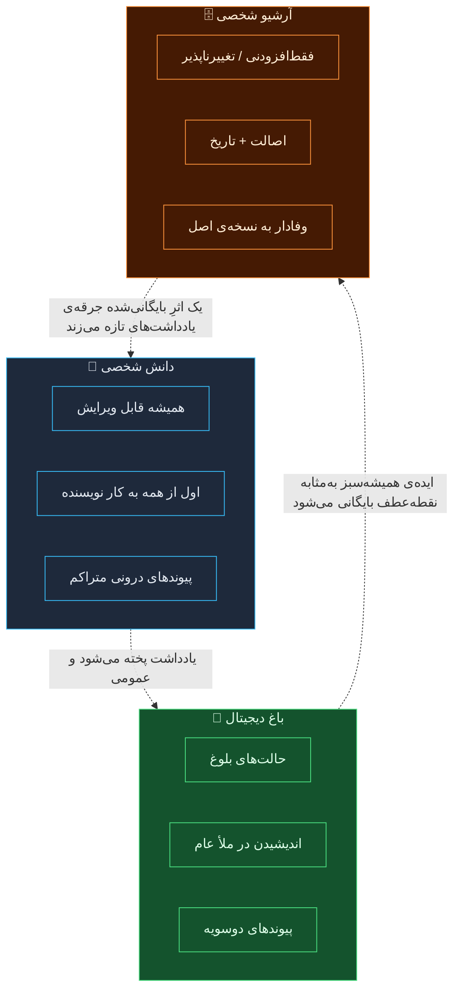
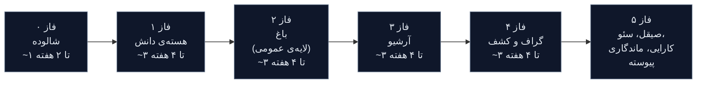
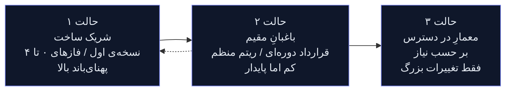
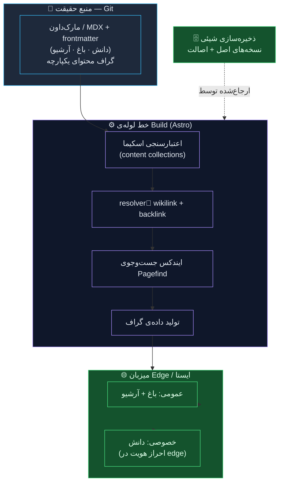

# دانش شخصی · باغ دیجیتال · آرشیو شخصی
### پاسخی به پنج پرسش شما — و نقشه‌ای از مسیری که برای ساخت این پروژه در نظر دارم

---

از بریف دقیق و سنجیده‌تان ممنونم. پیش از آنکه مستقیم سراغ پنج پرسش بروم، می‌خواهم یک نکته را روشن کنم: این‌ها در واقع پنج پرسش جدا نیستند. یک پرسش‌اند که از پنج زاویه پرسیده شده — *آیا واقعاً می‌فهمی این پروژه چیست، یا فقط یک سیستم مدیریت محتوا با سه بخش می‌بینی؟* به همین خاطر به هر پرسش مستقیم پاسخ داده‌ام، اما عمداً گذاشته‌ام طرز فکر و استدلالم هم پیدا باشد، چون همین استدلال است که در عمل دارید ارزیابی‌اش می‌کنید.

آنچه در ادامه می‌آید بخشی پاسخ‌نامه است، بخشی پیشنهاد فنی، و بخشی همان گفت‌وگویی که پیش از این داشتیم.

---

## ۰. پیش از هر چیز، سه مفهوم اصلی — چون همه‌چیز در ادامه به درست‌فهمیدن این‌ها وابسته است

بیشتر آدم‌ها این سه را در «یک وبلاگ با چند دسته‌بندی» خلاصه می‌کنند. اما این‌ها یکی نیستند. *چرخه‌ی عمر* متفاوت، *مخاطب* متفاوت و *شرط درستی* متفاوتی دارند، و همین تفاوت‌ها باید معماری را شکل بدهند — نه طراحی بصری.

### دانش شخصی (Personal Knowledge)
این یعنی **حافظه‌ی کاری که ماندگار شده است**. یادداشت‌ها، منابع، فهم تقطیرشده، چیزهایی که یک‌بار جست‌وجو کرده‌ای تا دیگر هرگز مجبور نباشی دوباره دنبالشان بگردی. ویژگی تعیین‌کننده‌اش این است که **اول از همه به کار خودِ نویسنده می‌آید**. یک یادداشت دانشی وقتی «تمام» است که مفید باشد، نه وقتی که صیقل‌خورده باشد. متراکم و پر از پیوندهای درونی است، اغلب کوتاه و موجز، و ارزشش از دل اتصال‌ها بیرون می‌آید، نه از کامل‌بودن تک‌تک یادداشت‌ها.

- **چرخه‌ی عمر:** پیوسته، هرگز «منتشرشده‌ی نهایی» نیست، همیشه قابل ویرایش
- **مخاطب اصلی:** خودِ نویسنده (عمومی‌بودن یک پیامد جانبی است)
- **شرط درستی:** *آیا این هنوز دقیق و برای من مفید است؟*

### باغ دیجیتال (Digital Garden)
این یعنی **اندیشیدن در ملأ عام**. باغ جایی است که ایده‌ها از نهال تا درختِ همیشه‌سبز، *به‌شکل آشکار* رشد می‌کنند. ویژگی تعیین‌کننده‌اش غیرخطی‌بودن و پذیرفتنِ صریح خامیِ ایده‌هاست. یک یادداشتِ باغ با افتخار می‌گوید «این هنوز نیم‌بند است». این درست نقطه‌ی مقابل «این نظر نهایی و پخته‌ی من است»ِ یک وبلاگ است. باغ‌ها از حالت‌های بلوغ (🌱 نهال ← 🌿 در حال رشد ← 🌳 همیشه‌سبز)، پیوندهای دوسویه و توپولوژی به‌جای ترتیب زمانی استفاده می‌کنند.

- **چرخه‌ی عمر:** ارگانیک، مرحله‌بندی‌شده بر اساس رشد، مدام بازبینی‌شونده
- **مخاطب اصلی:** هم خودِ نویسنده و هم مخاطب کنجکاوِ عمومی، در گفت‌وگویی واقعی
- **شرط درستی:** *آیا این تصویری صادقانه از همان‌جایی است که فکرم همین حالا ایستاده؟*

### آرشیو شخصی (Personal Archive)
این یعنی **سند و رکورد**. چیزهایی که اتفاق افتاده، چیزهایی که ساخته شده، چیزهایی که ارزش نگه‌داشتن دارند — *همان‌طور که بوده‌اند*. ویژگی تعیین‌کننده‌اش تغییرناپذیری و اصالت (provenance) است. ارزش یک ورودی آرشیو دقیقاً از *ویرایش‌نشدنش* می‌آید — یک عکس از سال ۱۳۹۸، یک پروژه‌ی تحویل‌داده‌شده، سخنرانی‌ای که داده‌ای. جایی که دانش و باغ زنده‌اند، آرشیو ثابت است. به تاریخ‌ها، نسخه‌های اصلی و یکپارچگی اهمیت می‌دهد.

- **چرخه‌ی عمر:** فقط‌افزودنی (append-only)؛ ورودی‌ها اضافه می‌شوند اما به‌ندرت تغییر می‌کنند
- **مخاطب اصلی:** خودِ آینده‌ات، و هر کسی که بخواهد یک تاریخ را بازسازی کند
- **شرط درستی:** *آیا این رکوردی وفادار از آن چیزی است که واقعاً بوده؟*

### این سه کجا هم‌پوشانی دارند و کجا فرق می‌کنند — و چرا این برای معماری مهم است

نکته‌ی کلیدی و تعیین‌کننده‌ی معماری این است: **این‌ها سه بخش از یک نوع محتوا نیستند — یک گرافِ محتواییِ واحدند که سه «سیاست ویرایشی» متفاوت روی آن نشسته است.** یک قطعه محتوا می‌تواند بین این سه جابه‌جا شود (یک یادداشت دانشیِ خصوصی پخته می‌شود و به یک نهالِ عمومی در باغ تبدیل می‌شود؛ یک ایده‌ی باغ ته‌نشین می‌شود و به یک نقطه‌عطفِ بایگانی‌شده بدل می‌گردد). لایه‌ی ذخیره‌سازیِ زیرین باید یکپارچه باشد؛ آنچه فرق می‌کند *قواعد انتشار، تضمین‌های تغییرپذیری و نحوه‌ی نمایش* است. اگر این را به‌شکل سه اپلیکیشن جدا بسازی، تا ابد با درزهای میانشان کلنجار می‌روی. اگر به‌شکل یک گراف با لایه‌های سیاست بسازی، کل سیستم نفس می‌کشد.

به‌نظر من همین یک تصمیم است که مرز میان پروژه‌ای که خوب پیر می‌شود و پروژه‌ای که ظرف هجده ماه از نو بازنویسی می‌شود را مشخص می‌کند.

---

## پرسش ۱ — برداشت من از مسئله‌ی اصلی

> *«برداشت شما از مسئله‌ی اصلی این پروژه چیست؟»*

در نگاه اول، مسئله این است: «دانش، ایده‌های نیم‌بند و تاریخچه‌ی شخصی‌ام در ابزارهای پراکنده (نوشن، اوبسیدین، کتابخانه‌های عکس، هارد‌های قدیمی و حافظه‌ی خودم) ریخته و می‌خواهم همه را در یک خانه‌ی واحد، تحت مالکیت خودم و زیبا گرد بیاورم.»

اما این *نشانه* است، نه خودِ بیماری. **مسئله‌ی اصلیِ واقعی** این است:

> **شما می‌خواهید سیستمی بسازید که به *سرشتِ زمانیِ متفاوتِ* انواع مختلف محتوا احترام بگذارد، ضمن آنکه آن‌ها را به هم متصل نگه دارد — و این کار را روی زیرساختی انجام دهید که خودتان مالک آن باشید، طوری که پنج سال دیگر هم نگه‌داری‌اش لذت‌بخش بماند.**

سه نیرو در کشمکش‌اند و کل پروژه در واقع درباره‌ی حل همین کشمکش است:

۱. **یکپارچگی در برابر تمایز.** همه‌چیز باید مثل یک ذهنِ به‌هم‌پیوسته حس شود — اما دانش، باغ و آرشیو واقعاً قواعد متفاوتی دارند. اگر بیش از حد یکپارچه‌اش کنی، به مِه و آشفتگی می‌رسی؛ اگر بیش از حد جدایشان کنی، به سه جزیره‌ی تنها.
۲. **زنده در برابر ماندگار.** بخشی از محتوا باید تا ابد قابل ویرایش بماند؛ بخشی باید تا ابد ثابت بماند. سیستم باید *در یک نفس* به هر دو احترام بگذارد.
۳. **نویسنده‌محور در برابر خواننده‌محور.** این فضای فکرکردنِ خودِ توست — اما منتشر هم می‌شود. اصطکاکِ نوشتن برای مخاطب می‌تواند اساساً عادتِ نوشتن را بکُشد. سیستم باید *ثبتِ خصوصی* را بی‌دردسر کند و *نمایشِ عمومی* را به یک گامِ جداگانه و اختیاری تبدیل کند.

فروشنده‌ای که فقط «سایت محتوایی با سه بخش» می‌شنود، یک قالبِ آماده‌ی CMS تحویلتان می‌دهد و تمام این‌ها را از دست می‌دهد. موفقیت یا شکست پروژه به این بستگی دارد که معماری این کشمکش‌ها را *به جان بخرد* و محترم بشمارد، نه اینکه رویشان سرپوش بگذارد. برداشت من این است.

---

## پرسش ۲ — مسیر فازبندی‌شده

> *«اگر پروژه مرحله‌به‌مرحله پیش برود، چه مسیری در نظر دارید؟»*

در برابر وسوسه‌ی ساختنِ هم‌زمانِ هر سه ستون مقاومت می‌کنم. ریسک، فنی نیست — ریسک این است که یک سیستمِ بی‌استفاده، یک سیستم مرده است. من طوری توالی را می‌چینم که هرچه سریع‌تر *خودِ شما* را به نوشتنِ روزانه برسانم، و بعد لایه‌به‌لایه بیرون گسترش بدهم.

**فاز ۰ — شالوده و مدل محتوا.** فازِ بی‌زرق‌وبرق اما تعیین‌کننده. اینجا اسکیمای محتوای یکپارچه، مدل پیوندها (یک `[[wikilink]]` چطور resolve می‌شود؟)، قالب ذخیره‌سازی (که سخت بر سرِ مارک‌داون/MDX + frontmatter در Git استدلال می‌کنم — در ادامه بیشتر) و خطِ لوله‌ی استقرار را میخکوب می‌کنیم. یک یادداشتِ رندرشده را روی production منتشر می‌کنیم. خسته‌کننده، و در عین حال مهم‌ترین فاز کل پروژه.

**فاز ۱ — هسته‌ی دانش (اول خصوصی).** ثبتِ بی‌اصطکاک، جست‌وجوی متن کامل و سریع، پیوندزنیِ درونی، و همان حلقه‌ی ویرایشی که *خودِ تو* هر روز در آن زندگی می‌کنی. دسترسی عمومی اینجا می‌تواند کاملاً خاموش باشد. هدف این فاز یک معیار است و بس: **آیا واقعاً هر روز ازش استفاده می‌کنی؟** اگر بله، باقی همه‌چیز پایین‌دستِ همین است. اگر نه، پیش از ساختن هر چیز دیگری همین را درست می‌کنیم.

**فاز ۲ — باغ دیجیتال (لایه‌ی عمومی).** حالا حالت‌های بلوغ، جریانِ «این یادداشت را در باغ منتشر کن»، نمایشِ پیوندهای بازگشتی (backlink) به خواننده و لایه‌ی نمایشِ عمومی را اضافه می‌کنیم. اینجاست که پروژه شخصیت پیدا می‌کند. داریم یک ابزارِ خصوصی را *عامدانه و برگشت‌پذیر* به یک فضای عمومی تبدیل می‌کنیم.

**فاز ۳ — آرشیو شخصی.** انواع محتوای فقط‌افزودنی، مدیریت رسانه (تصاویر، نسخه‌های اصل، EXIF/اصالت)، مرورِ تاریخ‌محور و تضمین‌های یکپارچگی. قواعدش آن‌قدر متفاوت است که فازِ مستقلِ خودش را می‌طلبد.

**فاز ۴ — گراف و کشف.** بافتِ هم‌بندنده: نمای گراف تعاملی، یادداشت‌های مرتبط، ناوبریِ «باغی از مسیرهای پرشاخه» و نقشه‌های محتوا. این فازِ *پاداش* است — فقط وقتی می‌درخشد که محتوای واقعی برای اتصال‌دادن وجود داشته باشد، و به همین خاطر دیر می‌آید.

**فاز ۵ — صیقل، سئو، کارایی، ماندگاری.** فیدهای RSS/JSON، داده‌ی ساختاریافته، sitemap، Open Graph، Core Web Vitals، دسترس‌پذیری، و همان کارِ نگه‌داری‌ای که اجازه می‌دهد این پروژه از سه ماه بی‌علاقگی و بازگشتِ دوباره‌ی *خودِ تو* جان سالم به‌در ببرد.

> رشته‌ی پیونددهنده: **حقِ ساختنِ ستون بعدی را با اثبات استفاده‌شدنِ ستون قبلی به‌دست بیاور.** سیستم‌های محتوایی بسیار بیشتر از مرگ بر اثر کدِ بد، بر اثر بی‌استفاده‌ماندن می‌میرند.

---

## پرسش ۳ — بزرگ‌ترین چالش / ریسک

> *«بزرگ‌ترین چالش یا ریسک چیست؟»*

بزرگ‌ترین ریسک **فنی نیست. رفتاری است، و اسمش پرتگاهِ رهاشدگی است.**

پروژه‌های محتوایی شخصی یک حالتِ شکستِ بی‌رحم دارند: ساختن هیجان‌انگیز است، نگه‌داری نیست، و سه ماه بعد سیستم با دوازده یادداشتِ خاک‌خورده در آن یخ می‌زند. یک باغ دیجیتالِ زیبا و کاملاً تحت مالکیتِ خودت با معماریِ بی‌نقص اما بدونِ محتوا، فقط راهی گران برای احساس گناه است.

پس ریسکِ شماره‌ی یک که از روز اول علیه‌اش طراحی می‌کنم این است: **اصطکاک میان تو و ثبتِ محتوا.** هر تصمیم معماری از این فیلتر رد می‌شود: «آیا این کار افزودنِ پانصدمین یادداشت را ساعت یازده شب سه‌شنبه آسان‌تر می‌کند یا سخت‌تر؟»

ریسک‌های ثانویه، با صداقت رتبه‌بندی‌شده:

| ریسک | چرا گاز می‌گیرد | چطور مهارش می‌کنم |
|---|---|---|
| **رهاشدگی / بی‌استفاده‌ماندن** | نگه‌داری بی‌زرق‌وبرق است؛ اصطکاک عادت را می‌کُشد | فاز ۱ اول‌خصوصی؛ بهینه‌سازیِ ثبت بالاتر از همه‌چیز؛ معیار استفاده‌ی روزانه به‌عنوان دروازه‌ی فاز ۱ |
| **مهندسیِ بیش‌ازحد در ابتدا** | ساختنِ هم‌زمانِ سه ستون + گراف وسوسه‌انگیز است | فازبندیِ سفت‌وسخت؛ انتشار یک یادداشت روی production در فاز ۰ |
| **قفل‌شدن محتوا** | اسکیمای دیتابیسِ سفارشی، یادداشت‌های عمرت را به دام می‌اندازد | مارک‌داون ساده + Git به‌عنوان منبع حقیقت؛ داده از اپ بیشتر عمر می‌کند |
| **دامِ آرشیوِ بی‌مرز** | آرشیوهای رسانه‌ای بادمی‌کنند؛ اصالت دردسرساز است | تصمیمِ مدل ذخیره‌سازی + یکپارچگی *پیش از* هر واردکردنِ داده |
| **فشارِ زودرسِ عمومی‌شدن** | نوشتن برای مخاطب در زمانِ زود، صداقت را می‌کُشد | باغ در فاز ۲ است، انتخابی، یادداشت‌به‌یادداشت؛ پیش‌فرض خصوصی است |
| **بدهیِ مهاجرت** | خروجی‌گرفتن از نوشن/اوبسیدین کثیف‌تر از آن است که به‌نظر می‌رسد | واردکردن را یک پروژه‌ی کوچکِ مستقل بدان، نه یک تیکِ ساده |

اگر بخواهم در یک جمله بگویم: **دشمنِ واقعی، آنتروپی است، نه پیچیدگی.** ترجیح می‌دهم چیزی کمی کم‌هوش‌تر تحویل بدهم که تا سال ۲۰۳۰ هم همچنان تغذیه‌اش می‌کنی.

---

## پرسش ۴ — کجا ممکن است به راهنمایی نیاز داشته باشید یا لازم باشد در فرض‌هایتان بازنگری کنید

> *«شما به‌عنوان صاحب پروژه، کجا ممکن است به راهنمایی نیاز داشته باشید — یا لازم باشد در فرض‌ها و تصمیم‌های خودتان بازنگری کنید؟»*

این مهم‌ترین پرسش است و صادقانه‌ترین پاسخ را به آن می‌دهم — چون شما پولی به من نمی‌دهید که باهاتان موافقت کنم. این‌ها فرض‌هایی‌اند که با احتیاط دوباره روی میز می‌گذارم:

**۱. «من به یک دیتابیس / یک CMS پیشرفته نیاز دارم.»**
احتمالاً نه — دست‌کم نه در لایه‌ی منبعِ حقیقت. برای یک پروژه‌ی شخصی و محتوامحور، **دیتابیس اغلب یک بدهی است، نه یک دارایی**: محتوای تو را در یک اسکیما قفل می‌کند، نوشتنت را به یک سرورِ روشن گره می‌زند، و «یادداشت‌های من» را به چیزی بدل می‌کند که حتی نمی‌توانی `grep`اش کنی. من شما را به سمت **فایل‌های مارک‌داون در Git** به‌عنوان منبعِ حقیقت هل می‌دهم، و دیتابیس فقط به‌عنوان یک *ایندکسِ مشتق‌شده* استفاده شود که هر لحظه بتوانی از روی همان فایل‌ها بازسازی‌اش کنی. محتوای تو باید از هر انتخاب فناوری‌ای که می‌کنیم بیشتر عمر کند. اگر با این فرض آمده‌اید که «از روز اول Postgres»، این همان فرضی است که بیش از همه دلم می‌خواهد با هم درباره‌اش بازنگری کنیم.

**۲. «هر سه ستون باید با هم لانچ شوند.»**
این درست به‌نظر می‌رسد و به گمان من غلط است — دقیقاً به همان دلایل رهاشدگی که بالاتر گفتم. غریزه‌ی «کامل لانچ‌کردن» همان چیزی است که سیستم‌های کامل اما خالی تولید می‌کند. از شما می‌خواهم اجازه بدهید پیش از ساختن باقی، ثابت کنم هسته‌ی دانش هر روز استفاده می‌شود.

**۳. «از همان ابتدا عمومی.»**
بازنگری کنید. فشارِ انتشار، قاتلِ خاموشِ نوشتنِ شخصی است. من برای «اول‌خصوصی، عمومی‌شدن به انتخاب» استدلال می‌کنم. درها را همیشه می‌توانی باز کنی؛ اما نمی‌توانی ماه‌ها یادداشتی را که هرگز ننوشتی، از خودسانسوری بیرون بکشی.

**۴. مرز میان باغ و آرشیو از آنچه به‌نظر می‌رسد محوتر است — و باید عامدانه درباره‌اش تصمیم بگیری.**
یک یادداشتِ در‌حال‌رشدِ باغ کِی به یک نقطه‌عطفِ بایگانی‌شده بدل می‌شود؟ یک مقاله‌ی تمام‌شده، باغِ همیشه‌سبز است یا آرشیو؟ پاسخ جهان‌شمولی ندارد، اما *تصمیم‌نگرفتن* همان راهی است که به محتوایی می‌رسی که نمی‌داند کدام قاعده روی آن اعمال می‌شود. زود یک جلسه‌ی کوتاه و صریح روی همین موارد مرزی می‌خواهم — جلوی دوباره‌کاری واقعی را می‌گیرد.

**۵. «جست‌وجو / گراف / قابلیت‌های هوش مصنوعی، هسته‌اند.»**
این‌ها *لذت‌اند*، نه *شالوده*. فقط وقتی ارزشمند می‌شوند که یک پیکره‌ی محتوایی وجود داشته باشد. عامدانه به تعویقشان می‌اندازم تا یک لایه‌ی کشف را روی یک اتاق خالی صیقل ندهیم. (با این حال — جست‌وجوی معنایی و «از یادداشت‌های خودم بپرس» با embeddingها یک افزوده‌ی واقعاً عالی برای فاز ۴ به بعد است، *به‌شرطِ وجود محتوا*. عاشق ساختنش‌ام؛ فقط اولش نمی‌سازمش.)

**۶. ماندگاری یک قابلیت است و باید یک الزام باشد.**
مهم‌ترین پرسش برای یک پروژه‌ی *شخصی* این نیست که «در لحظه‌ی لانچ چه شکلی است» — بلکه این است که «وقتی سرم شلوغ و بی‌حوصله‌ام، نگه‌داری‌اش چه حسی دارد؟» می‌خواهم نگه‌داری‌پذیری و یک مسیرِ خروجِ تمیز (export) به‌عنوان معیارهای پذیرشِ درجه‌یک تلقی شوند، نه فکرِ بعدی. این محتوای عمرِ توست. درِ خروج باید به‌خوبیِ درِ ورود ساخته شده باشد.

هیچ‌کدام از این‌ها به این معنا نیست که غریزه‌تان غلط است — این‌ها همان نقاط مشخصی‌اند که من، با تجربه‌ی ساختِ چیزهایی از این دست، انتظار دارم انتخابِ بدیهی، انتخابِ پرهزینه از آب دربیاید.

---

## پرسش ۵ — مدل ایده‌آلِ همکاریِ بلندمدت

> *«اگر این همکاری از نسخه‌ی اول فراتر برود و به یک شراکت بلندمدت تبدیل شود، مدل ایده‌آلِ همکاریِ شما چیست؟»*

برای یک پروژه‌ی شخصی، محتوامحور و دیرپا، مدلِ غلط این است: «آژانس می‌سازد، یک فایل zip تحویل می‌دهد، و ناپدید می‌شود.» این تضمینِ پوسیدگی است. مدلِ ایده‌آلِ من سه حالت دارد که در طول زمان تکامل پیدا می‌کنند:

**حالت ۱ — شریک ساخت (در طول نسخه‌ی اول).** همکاریِ نزدیک، تکرارشونده و صاحب‌نظر. چرخه‌های کوتاه، نمایش‌های مکرر، و زندگی‌کردنِ شما در محصول حین ساخته‌شدنش تا آن را با عادت‌های *واقعیِ* تو کوک کنیم، نه با عادت‌های فرضی. من رهبریِ فنی را به عهده می‌گیرم و یک شریکِ فکری برای محصول‌ام، نه صرفاً یک سفارش‌گیرنده.

**حالت ۲ — باغبانِ مقیم (وضعیت پایدار).** وقتی پروژه مالِ تو شد و روی روال افتاد، یک ریتمِ سبک و قابل‌پیش‌بینی: یک قرارداد ماهانه یا فصلی که نگه‌داری وابستگی‌ها، بهبودهای کوچک، مراقبت از کارایی/سئو و یک یادداشتِ همیشگیِ «اگر جای تو بودم، بعدش این را بهتر می‌کردم» را پوشش می‌دهد. این همان حالتی است که رهاشدگی را شکست می‌دهد — یک نبضِ کوچک و منظم، سیستم (و عادتِ نوشتن) را زنده نگه می‌دارد.

**حالت ۳ — معمارِ در دسترس (بر حسب نیاز).** برای آن چرخش‌های بزرگِ گاه‌به‌گاه — یک طراحیِ دوباره، یک ستونِ جدید، یک مهاجرت، یک لایه‌ی هوش مصنوعی/جست‌وجو. پروژه‌محور، بدون تعهد دائمی، اما با زمینه‌ی کسی که از پیش با کدبیس آشناییِ عمیق دارد.

آنچه در این شراکت برایم ارزش دارد: **شفافیت (تو همیشه مالک ریپازیتوری، داده و کلیدهای استقرار هستی — هیچ قفل‌شدنی به من هم وجود ندارد)، قضاوتِ مشترک به‌جای تیکت‌گرفتن، و گرایشی به سمتِ استقلالِ بلندمدتِ تو.** بهترین نتیجه، سیستمی است که *می‌توانستی* بدون من اجرایش کنی — و انتخاب می‌کنی مرا نگه داری چون با یک باغبان بهتر است.

---

## پشته‌ی فناوریِ پیشنهادی — همراه با توجیه

پشته مستقیماً از تحلیل مسئله بیرون می‌آید: **محتوا از کد بیشتر عمر می‌کند، اصطکاکِ ثبت دشمن است، ماندگاری یک قابلیت است.**

| لایه | پیشنهاد | چرا |
|---|---|---|
| **منبع حقیقت** | **مارک‌داون / MDX + frontmatter، در Git** | قابل‌حمل، آینده‌نگر، قابل diff، قابل grep، از هر فریم‌ورکی بیشتر عمر می‌کند. محتوای تو هرگز به دام نمی‌افتد. این مهم‌ترین انتخاب است. |
| **فریم‌ورک** | **Astro** (پیشنهاد اصلی) | ذاتاً محتوامحور؛ به‌صورت پیش‌فرض هیچ جاوااسکریپتی نمی‌فرستد ← Core Web Vitals و سئوی عالی؛ content collections + اعتبارسنجی اسکیما مثل دستکش روی این پروژه می‌نشیند؛ معماری islands اجازه می‌دهد تعامل (نمای گراف، جست‌وجو) را فقط جایی که لازم است اضافه کنیم. |
| *جایگزین فریم‌ورک* | Next.js (اگر تعاملِ اپ‌گونه‌ی غنی‌تر/قابلیت‌های هوش مصنوعی محوری باشند) | سنگین‌تر و جاوااسکریپت‌محورتر، اما بی‌رقیب برای قابلیت‌های پویا. برای یک سایت محتوایی Astro را برمی‌گزینم، و اگر به سمت یک اپ میل کرد، Next را. |
| **استایل‌دهی** | **Tailwind CSS** + یک لایه‌ی کوچکِ design-token | سریع، یکدست، قابل نگه‌داری؛ توکن‌ها سه ستون را بصری‌ متمایز اما یکپارچه نگه می‌دارند. |
| **پیوندزنی / backlinkها** | `[[wikilink]]`های resolve‌شده در زمان build، ایندکسِ backlinkِ دوسویه | کلِ ارزشِ باغ در اتصال‌هاست؛ آن‌ها را به‌شکل ایستا resolve کن تا سرعت بالا برود. |
| **جست‌وجو** | **Pagefind** (ایندکسِ ایستا و زمان‌build) ← ارتقا به embeddings/معنایی بعداً | Pagefind جست‌وجوی متن کاملِ آنیِ سمت‌کلاینت بدون هیچ سروری می‌دهد. «از یادداشت‌هایم بپرس»ِ معنایی با embeddingها افزوده‌ی عالیِ فاز ۴ به بعد است، *وقتی محتوا وجود دارد*. |
| **رسانه / آرشیو** | ذخیره‌سازی شیئی (Cloudflare R2 / S3) + حفظ نسخه‌های اصل + نگه‌داری EXIF/اصالت | یکپارچگیِ آرشیو ایجاب می‌کند نسخه‌های اصل دست‌نخورده بمانند؛ ذخیره‌سازیِ شیئیِ ارزان همراه با رشدِ مجموعه مقیاس می‌گیرد. |
| **ایندکسِ مشتق‌شده (اختیاری)** | SQLite (قابلِ بازسازی از روی مارک‌داون) | دیتابیس را فقط به‌عنوان یک *کشِ* دورانداختنی و قابلِ بازتولید به‌کار ببر. هرگز به‌عنوان منبعِ حقیقت. |
| **میزبانی** | **Cloudflare Pages / Netlify / Vercel** (ایستا + edge) | خروجیِ ایستا = سریع، ارزان، امن، نگه‌داریِ نزدیک‌به‌صفر. نگه‌داری‌پذیری دقیقاً همان هدف است. |
| **CI/CD** | push روی Git ← build ← deploy؛ پیش‌نمایش per-branch | نوشتنِ یک یادداشت = یک Git commit = یک deploy. ثبت و انتشار یک حرکتِ واحد می‌شوند. |
| **احراز هویت (لایه‌ی خصوصی)** | احراز هویت در edge / قواعد دسترسی برای دانشِ خصوصی، عمومی برای باغ/آرشیو | فاز ۱ِ اول‌خصوصی به یک دروازه‌ی تمیز نیاز دارد؛ ایستا + edge این را بدون backend مدیریت می‌کند. |

شکلِ این پشته عامدانه است: **چیزِ ارزشمند (محتوای تو) در قابل‌دوام‌ترین و کم‌قفل‌ترین قالبِ ممکن می‌نشیند، و باقیِ همه‌چیز یک لایه‌ی قابلِ بازتولید روی آن است.** اگر فردا Astro ناپدید شود، یادداشت‌های تو خم به ابرو نمی‌آورند.

---

## استراتژی سئو — مختص سایت‌های شخصیِ محتوا-سنگین

توصیه‌های عمومیِ سئو اینجا فقط سروصداست. برای یک سایت دانش/باغِ شخصی، استراتژی را سه واقعیت شکل می‌دهد: **محتوا تنها داراییِ رتبه‌بندی توست، پیوندزنیِ درونی ابرقدرتی است که همین حالا رایگان تولیدش می‌کنی، و سیگنال‌های تازگی برای یک سایتِ زنده مهم‌اند.**

**شالوده‌ها (در فاز ۵، اما از فاز ۰ طراحی‌شده):**
- **رندرِ ایستا + Core Web Vitalsِ عالی.** پیش‌فرضِ بدون‌جاوااسکریپتِ Astro یک هدیه‌ی سئویی است — صفحاتِ سریع هم رتبه می‌گیرند و هم تبدیل می‌کنند. تصاویرِ واقعی بهینه‌شده، LCPِ فشرده، بدون layout shift.
- **URLهای تمیز، پایدار و معنادار.** مثل `/garden/idea-slug`، `/archive/2024/thing`. دائمی — هرگز یک URL را نشکن؛ اگر مجبور به جابه‌جایی شدی، redirect کن. اعتبارِ پیوندها فقط روی آدرس‌های پایدار انباشته می‌شود.
- **داده‌ی ساختاریافته‌ی per-content-type (JSON-LD):** نوعِ `Article`/`BlogPosting` برای یادداشت‌های باغ، `CreativeWork`/`Collection` برای ورودی‌های آرشیو، `Person` + `sameAs` برای خودِ تو. این‌گونه است که موتورهای جست‌وجو یک گرافِ دانشِ شخصی را می‌فهمند.
- **Sitemap + فیدهای RSS/JSON، تولیدِ خودکار.** فیدها صرفاً سئو نیستند — راهی‌اند که یک باغ دیجیتال مخاطبِ بازگشتی می‌سازد.

**اهرمِ منحصربه‌فردِ این پروژه:**
- **پیوندزنیِ درونی به‌مثابه اقتدارِ موضوعی.** تو *همین حالا* داری `[[wikilink]]` می‌نویسی، آن هم به نفع خودت. وقتی این‌ها به‌شکل لینک‌های واقعی `<a>` + backlink نمایش داده شوند، آن گرافِ درونیِ متراکم دقیقاً همان ساختارِ خوشه‌ی موضوعی‌ای است که مشاورانِ سئو پولِ کلان بابتش می‌گیرند. رندرش کن، و گرافِ دانشت *همان* سنگرِ سئوی تو می‌شود.
- **خوشه‌های موضوعی از دل مدلِ بلوغ.** یادداشت‌های همیشه‌سبزِ 🌳 به‌طور طبیعی به صفحاتِ «ستونی» (pillar) بدل می‌شوند؛ نهال‌ها به آن‌ها پیوند می‌خورند و بالا می‌آیند. استعاره‌ی باغ و معماریِ خوبِ سئو، تصادفاً، یک شکل دارند.
- **سیگنال‌های تازگی از یک سایتِ زنده.** تاریخِ `created` / `updated` را صادقانه نشان بده؛ یک باغِ فعالانه‌مراقبت‌شده سیگنال‌های تازگیِ قوی می‌فرستد. یادداشت‌های «اخیراً مراقبت‌شده» را برجسته کن.
- **Open Graph / کارت‌های توییتر per-note** تا لینک‌های به‌اشتراک‌گذاشته‌شده عامدانه به‌نظر برسند — مسیرِ غالبِ کشفِ سایت‌های شخصی، اشتراک‌گذاریِ یک یادداشتِ عالی توسط یک انسان است، نه یک جست‌وجوی گوگل.

**آنچه *نمی‌کنم*:** دنبالِ کلمات کلیدی دویدن، نوشتن برای الگوریتم، یا قربانی‌کردنِ صداقتِ نویسنده‌محورِ باغ به خاطر ترافیک. برای یک سایت شخصی، **استراتژی سئو یعنی «چیزهای واقعاً مفید بنویس و گراف را برای خزنده‌ها خوانا کن.»** هرچه بالا گفتم صرفاً برداشتنِ اصطکاک میان محتوای واقعیِ تو و آدم‌هایی است که برایشان ارزشمند است.

---

## جمع‌بندی

اگر کارم را درست انجام داده باشم، این سند به پنج پرسش‌تان پاسخ داده — اما مهم‌تر از آن، *شکلِ طرز فکرم درباره‌ی پروژه‌ای از این دست* را نشانتان داده است: محتوا پیش از کد، عادت پیش از قابلیت، دوام پیش از زیرکی، و پشتیبانیِ صادقانه پیش از موافقتِ آسان.

چیزی که بیش از همه می‌خواهم با خودتان ببرید این است: **این یک وب‌سایتِ سه‌بخشی نیست. یک ذهنِ به‌هم‌پیوسته است با سه سیاستِ ویرایشی، ساخته‌شده روی زیرساختی که کاملاً مالکش هستی، و طراحی‌شده طوری که مهم‌ترین کاربر — یعنی خودت، شش ماه دیگر، خسته و بی‌انگیزه — همچنان تغذیه‌اش را بی‌دردسر بیابد.**

