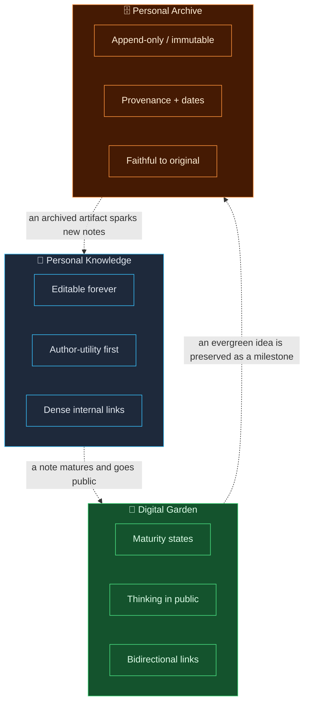
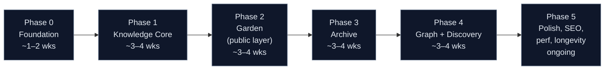
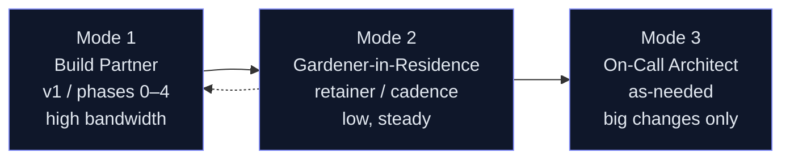
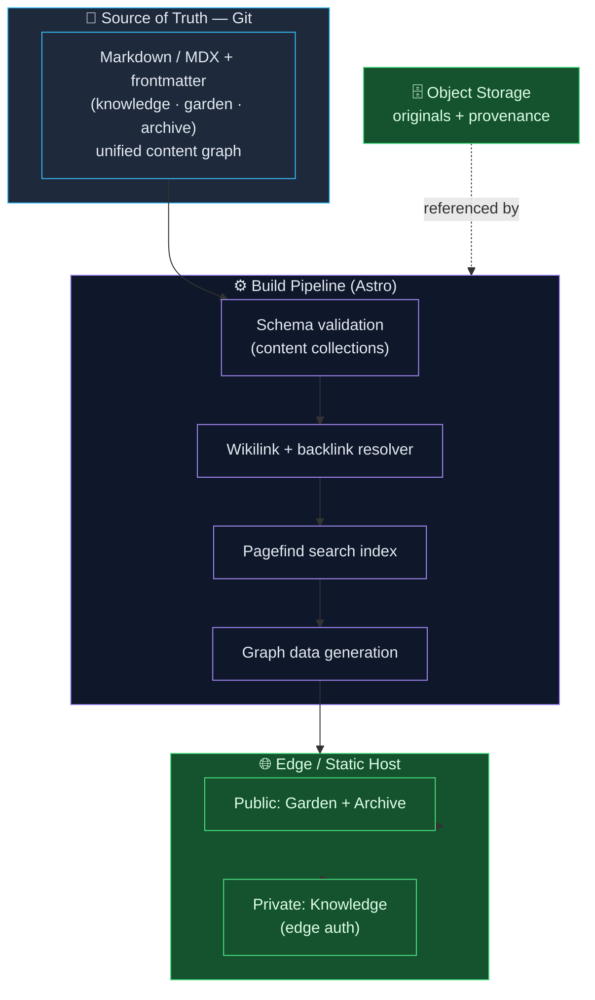

# Personal Knowledge · Digital Garden · Personal Archive
### A Response to Your Five Questions — and a Map of How I'd Build This

---

Thank you for the thoughtful brief. Before answering the five questions directly, I want to name something: these aren't really five separate questions. They're one question asked from five angles — *do you actually understand what this is, or do you just see a CMS with three sections?* So I've answered each one directly, but I've also let my reasoning show, because that reasoning is the thing you're actually evaluating.

What follows is part of that response, part of that proposal, and part of a conversation we had earlier.
---

## 0. First, the three concepts — because everything downstream depends on getting these right

Most people collapse these three into "a blog with categories." They are not the same thing. They have different *lifecycles*, different *audiences*, and different *truth conditions*, and those differences should drive the architecture, not the visual design.

### Personal Knowledge
This is **working memory made durable**. Notes, references, distilled understanding, things-I-looked-up-so-I-never-have-to-again. The defining property is **utility to the author first**. A personal knowledge note is "done" when it's useful, not when it's polished. It's densely interlinked, often terse, and its value compounds through connection rather than through individual completeness.

- **Lifecycle:** continuous, never "published," always editable
- **Primary audience:** the author (the public is a side effect)
- **Truth condition:** *is this still accurate and useful to me?*

### Digital Garden
This is **thinking in public**. The garden is where ideas grow from seedling to evergreen *visibly*. The defining property is **non-linearity and explicit immaturity**. A garden note proudly says "this is half-formed." It's the opposite of a blog's "here is my finished take." Gardens use maturity states (🌱 seedling → 🌿 budding → 🌳 evergreen), bidirectional links, and topology over chronology.

- **Lifecycle:** organic, growth-staged, frequently revisited
- **Primary audience:** the author *and* a curious public, in genuine dialogue
- **Truth condition:** *is this an honest snapshot of where my thinking is right now?*

### Personal Archive
This is **the record**. Things that happened, things that were made, things worth preserving *as they were*. The defining property is **immutability and provenance**. An archive entry's value comes precisely from *not* being edited — a 2019 photo, a shipped project, a talk you gave. Where knowledge and garden are living, the archive is fixed. It cares about dates, originals, and integrity.

- **Lifecycle:** append-only; entries are added but rarely changed
- **Primary audience:** future-you, and anyone reconstructing a history
- **Truth condition:** *is this a faithful record of what actually was?*

### How they overlap and differ — and why it matters for architecture

The critical architectural insight: **these are not three sections of one content type — they are one content graph with three different *editorial policies* on top of it.** A piece of content can migrate between them (a private knowledge note matures into a public garden seedling; a garden idea crystallizes into an archived milestone). The underlying storage should be unified; the *publishing rules, mutability guarantees, and presentation* differ. Build it as three separate apps and you'll fight the seams forever. Build it as one graph with policy layers and the whole thing breathes.

This single decision is, in my view, what separates a project that ages well from one that gets rewritten in eighteen months.

---

## Question 1 — My interpretation of the core problem

> *"What's your understanding of this project's core problem?"*

On the surface, the problem is "I have knowledge, half-formed ideas, and a personal history scattered across tools (Notion, Obsidian, photo libraries, old drives, my own memory) and I want a single, owned, beautiful home for them."

But that's the *symptom*. The **actual core problem** is this:

> **You are trying to build a system that respects the different *temporal natures* of different kinds of content, while keeping them connected — and to do it on infrastructure you own, in a way that's still pleasant to maintain in five years.**

Three forces are in tension, and the whole project is really about resolving them:

1. **Unification vs. distinction.** Everything should feel like one connected mind — but knowledge, garden, and archive have genuinely different rules. Over-unify and you get mush; over-separate and you get three lonely silos.
2. **Living vs. permanent.** Some content must stay editable forever; some must stay frozen forever. The system has to honor both *in the same breath*.
3. **Author-first vs. reader-first.** This is your space to think — but it's also published. The friction of writing for an audience can kill the habit of writing at all. The system has to make *private capture* effortless and *public presentation* a separate, optional step.

A vendor who hears "content site, three sections" will build you a themed CMS and miss all of this. The project succeeds or fails on whether the architecture honors these tensions rather than papering over them. That's my read.

---

## Question 2 — Phased path

> *"If the project moves in phases, what path do you envision?"*

I'd resist the temptation to build all three pillars at once. The risk isn't technical — it's that an unused system is a dead system. I'd sequence to get *you* writing daily as fast as possible, then layer outward.

**Phase 0 — Foundation & content model.** The unglamorous, decisive phase. We nail the unified content schema, the linking model (how do `[[wikilinks]]` resolve?), the storage format (I'll argue hard for Markdown/MDX + frontmatter in Git — more below), and the deploy pipeline. We ship a single rendered note to production. Boring, and the most important phase in the project.

**Phase 1 — Knowledge core (private-first).** Frictionless capture, fast full-text search, internal linking, the editing loop *you* live in daily. Public access can be off entirely here. The goal of this phase is a single metric: **are you actually using it every day?** If yes, everything else is downstream. If no, we fix that before building anything else.

**Phase 2 — Digital Garden (the public layer).** Now we add maturity states, the "publish this note to the garden" workflow, backlinks shown to readers, and the public presentation layer. This is where the project gets its personality. We're turning a private tool into a public space *deliberately and reversibly*.

**Phase 3 — Personal Archive.** Append-only content types, media handling (images, originals, EXIF/provenance), date-driven browsing, integrity guarantees. Different enough in its rules that it earns its own phase.

**Phase 4 — Graph & discovery.** The connective tissue: the interactive graph view, related-notes, "garden of forking paths" navigation, maps of content. This is the *payoff* phase — it only sparkles once there's real content to connect, which is why it comes late.

**Phase 5 — Polish, SEO, performance, longevity.** RSS/JSON feeds, structured data, sitemaps, Open Graph, Core Web Vitals, accessibility, and the maintainability work that lets this survive *you* losing interest for three months and coming back.

> The throughline: **earn the right to build the next pillar by proving the last one gets used.** Content systems die from disuse far more often than from bad code.

---

## Question 3 — Biggest challenge / risk

> *"What's the biggest challenge or risk?"*

The biggest risk is **not technical. It's behavioral, and it's the abandonment cliff.**

Personal content projects have a brutal failure mode: the build is exciting, the maintenance is not, and three months in the system is frozen with twelve notes in it. A beautiful, owned, perfectly-architected digital garden with no content is just an expensive way to feel guilty.

So the #1 risk I design *against* from day one is **friction between you and capture.** Every architectural choice gets filtered through "does this make it easier or harder to add the 500th note at 11pm on a Tuesday?"

The secondary risks, ranked honestly:

| Risk | Why it bites | How I mitigate |
|---|---|---|
| **Abandonment / disuse** | Maintenance is unglamorous; friction kills the habit | Private-first Phase 1; capture optimized above all; daily-use metric as the Phase 1 gate |
| **Over-engineering early** | Three pillars + graph is tempting to build at once | Strict phasing; ship one note to prod in Phase 0 |
| **Content lock-in** | A bespoke DB schema traps your life's notes | Plain Markdown + Git as source of truth; the data outlives the app |
| **The unbounded-archive trap** | Media archives balloon; provenance is fiddly | Decide storage + integrity model *before* importing anything |
| **Premature public pressure** | Writing for an audience too early kills honesty | Garden is Phase 2, opt-in, per-note; private is the default |
| **Migration debt** | Notion/Obsidian export is messier than it looks | Treat import as its own scoped mini-project, not a checkbox |

If I had to put it in one sentence: **the real adversary is entropy, not complexity.** I'd rather ship something slightly less clever that you'll still be feeding in 2030.

---

## Question 4 — Where you might need guidance or to reconsider

> *"As the project owner, where might you need guidance — or to rethink your own assumptions?"*

This is the question that matters most, and the one I'll answer most candidly — because you're not paying me to agree with you. Here are the assumptions I'd gently put back on the table:

**1. "I need a database / a fancy CMS."**
Probably not — at least not at the source-of-truth layer. For a personal, content-first project, a **database is often a liability, not an asset**: it locks your content in a schema, couples your writing to a running server, and makes "my notes" something you can't `grep`. I'd push you toward **Markdown files in Git** as the canonical store, with any database used only as a *derived index* you can rebuild from the files at any time. Your content should outlive every technology choice we make. If you came in assuming Postgres-from-day-one, this is the assumption I'd most want to revisit together.

**2. "All three pillars should launch together."**
This feels right and is, I think, wrong — for the abandonment reasons above. The instinct to launch "complete" is exactly what produces empty, complete systems. I'd ask you to let me prove the knowledge core gets daily use before we build the rest.

**3. "Public from the start."**
Reconsider. Publishing pressure is the silent killer of personal writing. I'd argue for private-first, public-by-choice. You can always open the doors; you can't un-self-censor months of notes you never wrote.

**4. The boundary between Garden and Archive is fuzzier than it looks — and you should decide it on purpose.**
When does a maturing garden note become an archived milestone? Is a finished essay garden-evergreen or archive? There's no universal answer, but *not deciding* is how you end up with content that doesn't know which rules apply to it. I'd want a short, explicit working session on these edge cases early — it'll save real rework.

**5. "Search / graph / AI features are core."**
They're *delight*, not *foundation*. They only become valuable once there's a corpus. I'd consciously defer them so we don't polish a discovery layer over an empty room. (That said — semantic search and "ask my own notes" via embeddings is a genuinely great Phase 4+ addition *once content exists*. I'd love to build it; I just won't build it first.)

**6. Longevity is a feature, and it should be a requirement.**
The most important question for a *personal* project isn't "how does this look at launch" — it's "how does this feel to maintain when I'm busy and uninspired?" I'd want maintainability and a clean export path treated as first-class acceptance criteria, not afterthoughts. This is your life's content. The exit door should be as well-built as the front door.

None of these are me saying your instincts are wrong — they're the specific places where, having built things like this, I'd expect the obvious choice to be the costly one.

---

## Question 5 — Ideal long-term collaboration model

> *"If this extends past v1 into a long-term partnership, what's your ideal model?"*

For a personal, content-driven, long-lived project, the wrong model is "agency builds it, hands over a zip, disappears." That guarantees rot. My ideal model has three modes that evolve over time:

**Mode 1 — Build Partner (during v1).** Close, iterative, opinionated collaboration. Short cycles, frequent demos, you living in the product as it's built so we tune to *your* real habits, not hypothetical ones. I lead technically and act as a thinking partner on the product, not just an order-taker.

**Mode 2 — Gardener-in-Residence (steady state).** Once it's yours and humming, a light, predictable cadence: a monthly or quarterly retainer covering dependency upkeep, small enhancements, performance/SEO tending, and a standing "here's what I'd improve next" note. This is the mode that beats abandonment — a small, regular pulse keeps the system (and the writing habit) alive.

**Mode 3 — On-Call Architect (as needed).** For the occasional big swing — a redesign, a new pillar, a migration, an AI/search layer. Project-scoped, no standing commitment, but with the context of someone who already knows the codebase intimately.

What I value in the partnership: **transparency (you always own the repo, the data, and the deploy keys — no lock-in to me either), shared judgment over ticket-taking, and a bias toward your long-term independence.** The best outcome is a system you *could* run without me — and choose to keep me around because it's better with a gardener.

---

## Recommended tech stack — with justifications

The stack follows directly from the problem analysis: **content outlives code, capture friction is the enemy, longevity is a feature.**

| Layer | Recommendation | Why |
|---|---|---|
| **Source of truth** | **Markdown / MDX + frontmatter, in Git** | Portable, future-proof, diff-able, greppable, survives every framework. Your content is never trapped. This is the single most important choice. |
| **Framework** | **Astro** (primary recommendation) | Content-first by design; ships zero JS by default → excellent Core Web Vitals and SEO; content collections + schema validation fit this project like a glove; islands let us add interactivity (graph view, search) only where needed. |
| *Alt framework* | Next.js (if richer app-like interactivity/AI features are central) | More heft and JS, but unmatched for dynamic features. I'd pick Astro for a content site, Next if it's trending toward an app. |
| **Styling** | **Tailwind CSS** + a small design-token layer | Fast, consistent, maintainable; tokens keep the three pillars visually distinct yet unified. |
| **Linking / backlinks** | `[[wikilinks]]` resolved at build, bidirectional backlink index | The garden's whole value is in connections; resolve them statically for speed. |
| **Search** | **Pagefind** (static, build-time index) → upgrade to embeddings/semantic later | Pagefind gives instant client-side full-text search with no server. Semantic "ask my notes" via embeddings is a great Phase 4+ add *once content exists*. |
| **Media / archive** | Object storage (Cloudflare R2 / S3) + originals preserved + EXIF/provenance kept | Archive integrity demands originals stay untouched; cheap object storage scales with the collection. |
| **Derived index (optional)** | SQLite (rebuildable from Markdown) | Use a DB only as a *cache* you can throw away and regenerate. Never as the source of truth. |
| **Hosting** | **Cloudflare Pages / Netlify / Vercel** (static + edge) | Static output = fast, cheap, secure, near-zero maintenance. Maintainability is the point. |
| **CI/CD** | Git push → build → deploy; previews per branch | Writing a note = a Git commit = a deploy. Capture and publish become the same gesture. |
| **Auth (private layer)** | Edge auth / access rules for private knowledge, public for garden/archive | Private-first Phase 1 needs a clean gate; static + edge handles it without a backend. |

The shape of this stack is deliberate: **the valuable thing (your content) sits in the most durable, least-locked format possible, and everything else is a regenerable layer on top.** If Astro disappears tomorrow, your notes don't care.

---

## SEO strategy — specific to content-heavy personal sites

Generic SEO advice is noise here. For a personal knowledge/garden site, the strategy is shaped by three realities: **content is your only ranking asset, internal linking is a superpower you already generate for free, and freshness signals matter for a living site.**

**Foundations (Phase 5, but designed-in from Phase 0):**
- **Static rendering + great Core Web Vitals.** Astro's zero-JS default is an SEO gift — fast pages rank and convert. Real images optimized, LCP tight, no layout shift.
- **Clean, stable, semantic URLs.** `/garden/idea-slug`, `/archive/2024/thing`. Permanent — never break a URL; redirect if you must move one. Link equity compounds only on stable addresses.
- **Per-content-type structured data (JSON-LD):** `Article`/`BlogPosting` for garden notes, `CreativeWork`/`Collection` for archive entries, `Person` + `sameAs` for you. This is how search engines understand a personal knowledge graph.
- **Sitemaps + RSS/JSON feeds, auto-generated.** Feeds aren't just SEO — they're how a digital garden builds a returning audience.

**The leverage unique to this project:**
- **Internal linking as topical authority.** You're *already* writing `[[wikilinks]]` for your own benefit. Surfaced as real `<a>` links + backlinks, that dense internal graph is exactly the topical-cluster structure SEO consultants charge fortunes to engineer. Render it, and your knowledge graph *is* your SEO moat.
- **Topic clusters via the maturity model.** Evergreen 🌳 notes become natural "pillar" pages; seedlings link up into them. The garden metaphor and good SEO architecture happen to be the same shape.
- **Freshness signals from a living site.** Show `created` / `updated` dates honestly; an actively-tended garden sends strong freshness signals. Surface "recently tended" notes.
- **Open Graph / Twitter cards per note** so shared links look intentional — the dominant discovery path for personal sites is a human sharing a single great note, not a Google query.

**What I'd *not* do:** chase keywords, write for algorithms, or compromise the author-first honesty of the garden for traffic. For a personal site, **the SEO strategy is "write genuinely useful things and make the graph legible to crawlers."** Everything above is just removing friction between your real content and the people who'd value it.

---

## Closing

If I've done my job, this document answered your five questions — but more importantly it showed you the *shape of how I think about a project like this*: content before code, habit before features, durability before cleverness, and honest pushback before easy agreement.

The thing I'd most want you to take away: **this isn't a three-section website. It's one connected mind with three editorial policies, built on infrastructure you fully own, designed so that the most important user — you, six months from now, tired and uninspired — still finds it effortless to feed.**

I'd be glad to turn any section of this into a concrete Phase 0 plan whenever you're ready.
