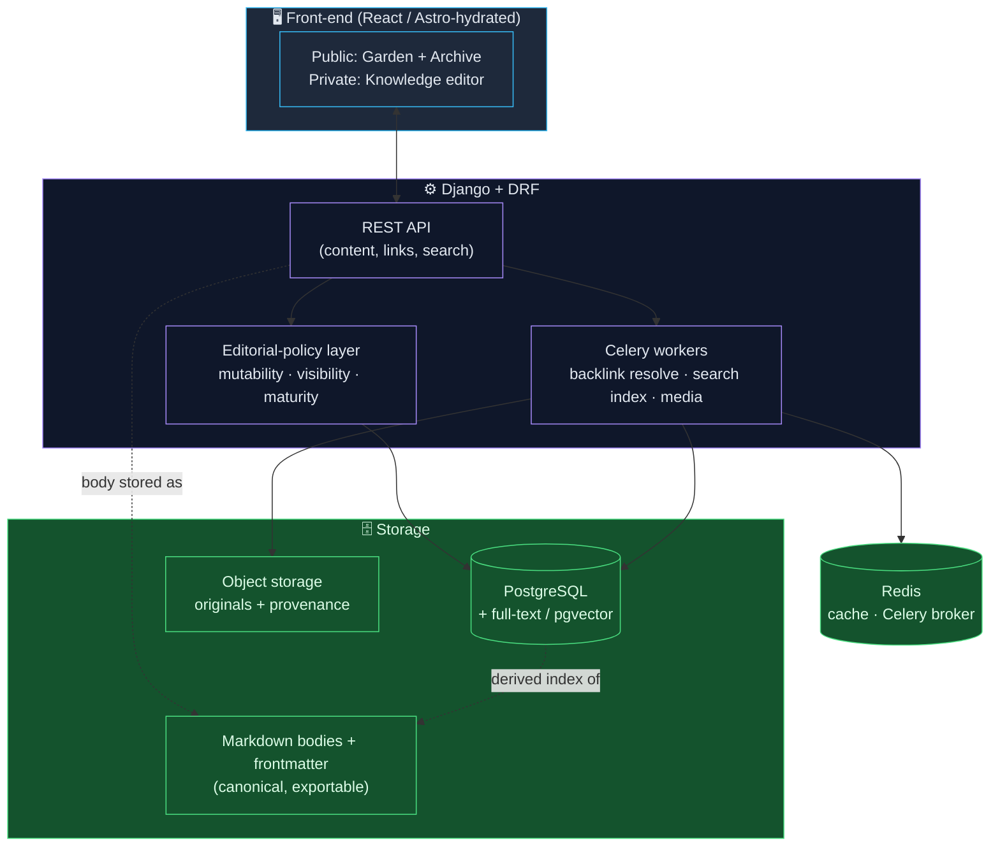
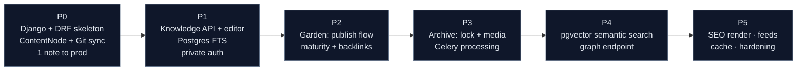

# Technical Development Plan
### Personal Knowledge · Digital Garden · Personal Archive — Python Backend Edition

> **A note on this architecture.** The main proposal argued for a Markdown-in-Git / Astro stack because *content longevity* and *zero capture friction* are the core problem. This document instead lays out a **Python (Django + DRF) backend**, as requested. That's a fully valid path — especially when the team's home turf is Django — but it trades some "content outlives code" purity for a dynamic, API-driven system. The plan below keeps the good parts of the original (Markdown as the real content format, a guaranteed export path) *while* giving you a proper Python backend. The tension is called out where it matters, not hidden.

---

## 1. Architecture at a glance

A decoupled system: **Django + DRF API** at the core, **React** front-end consuming it, **Postgres** as primary store, with Markdown kept as the canonical content body so nothing is trapped in a schema.



**Key principle preserved:** the content *body* is stored as Markdown + frontmatter (in a DB text column and synced to a Git-backed directory). Postgres holds structured metadata and a derived index. You can `export → .md files` at any moment, so the Python/DB layer never becomes a cage.

---

## 2. Recommended stack (Python backend)

| Layer | Choice | Why this one |
|---|---|---|
| **Backend framework** | **Django + Django REST Framework** | Batteries-included: ORM, admin, auth, migrations. DRF gives clean, versioned APIs. Matches your daily stack — fastest path to a maintainable, correct backend. |
| *Lighter alt* | FastAPI | Pick only if the system is more "thin API + heavy front-end" than "content app with admin/auth needs." Django wins here because the admin alone covers half the archive-management UI for free. |
| **Database** | PostgreSQL | Full-text search (`tsvector`/GIN), JSONB for flexible frontmatter, and `pgvector` for semantic "ask my notes" later — one engine covers search now and AI later. |
| **Canonical content** | Markdown + YAML frontmatter | Stored in a `body_md` column **and** synced to a Git repo. Guarantees portability and a clean export path. |
| **Async / jobs** | Celery + Redis | Backlink resolution, search re-indexing, media processing, scheduled Git sync — all off the request path. |
| **Cache / broker** | Redis | Response cache for public pages; Celery broker; rate-limit store. |
| **Search** | Postgres FTS → `pgvector` (Phase 4+) | No extra service early. Add embeddings for semantic search once a corpus exists. |
| **Media / archive** | S3-compatible object storage (or VPS disk + nginx) | Originals preserved untouched; EXIF/provenance stored as metadata rows. |
| **Front-end** | React (or Astro w/ islands) | Public Garden/Archive can be statically rendered for SEO; the private Knowledge editor is a React SPA against the API. |
| **Server** | Gunicorn/Uvicorn + nginx | Standard, boring, reliable production setup. |
| **Packaging** | Docker Compose | `web` · `db` · `redis` · `celery` · `nginx` — reproducible, and the same compose file runs on any VPS. |

---

## 3. Data model — one graph, three policies

The architectural keystone from the proposal, expressed in Django: **one `ContentNode` model**, with the three pillars as a *policy* on that node, not three separate models.

```python
class ContentNode(models.Model):
    class Pillar(models.TextChoices):
        KNOWLEDGE = "knowledge"   # editable forever, author-first
        GARDEN    = "garden"      # public, maturity-staged
        ARCHIVE   = "archive"     # append-only, immutable

    class Maturity(models.TextChoices):
        SEEDLING = "seedling"     # 🌱
        BUDDING  = "budding"      # 🌿
        EVERGREEN = "evergreen"   # 🌳

    id          = models.UUIDField(primary_key=True, default=uuid4)
    pillar      = models.CharField(choices=Pillar.choices)
    title       = models.CharField(max_length=300)
    slug        = models.SlugField(unique=True)          # permanent URL
    body_md     = models.TextField()                     # canonical Markdown
    frontmatter = models.JSONField(default=dict)         # flexible metadata
    maturity    = models.CharField(choices=Maturity.choices, null=True)  # garden only
    is_public   = models.BooleanField(default=False)     # private-first default
    is_locked   = models.BooleanField(default=False)     # archive immutability flag
    created_at  = models.DateTimeField(auto_now_add=True)
    updated_at  = models.DateTimeField(auto_now=True)
    search_vec  = SearchVectorField(null=True)           # Postgres FTS

class Link(models.Model):                                # the [[wikilink]] graph
    source = models.ForeignKey(ContentNode, related_name="links_out", on_delete=CASCADE)
    target = models.ForeignKey(ContentNode, related_name="links_in",  on_delete=CASCADE)
    # backlinks = target.links_in  → free bidirectional graph
```

The three editorial policies are enforced in one place (DRF serializer/permission layer), **not** scattered:

- **Knowledge** — always editable; `is_public=False` by default (private-first).
- **Garden** — `is_public=True` only on explicit publish; exposes `maturity`; shows backlinks to readers.
- **Archive** — once saved, `is_locked=True`; the API rejects body edits (append-only), preserving provenance.

This is how "one content graph, three policies" stops being a slogan and becomes ~30 lines of enforceable code.

---

## 4. Build sequence (maps to the 6 phases)



- **P0** — `docker-compose` (web/db/redis), `ContentNode` model, DRF + auth, Celery task that syncs `body_md` → Git on save. Deploy one rendered note.
- **P1** — Knowledge CRUD API + React editor; Postgres full-text search; private-first auth gate. **Gate: are you using it daily?**
- **P2** — Garden publish workflow, maturity states, backlink resolution (Celery), public read API.
- **P3** — Archive lock semantics + media pipeline (upload → object storage, EXIF extraction, thumbnails via Celery).
- **P4** — `pgvector` embeddings for semantic "ask my notes"; graph-data endpoint for the visual map.
- **P5** — server-side render public pages for SEO, RSS/JSON feeds, Redis page cache, security hardening, backups.

---

## 5. Launching on an Iranian VPS

A Python/Django + Docker stack runs cleanly on an Iranian VPS (ابرآروان / Arvan, پارس‌پک / Parspack, ایران‌سرور, مبین‌هاست, etc.). The practical considerations are operational, not architectural.

### Why an Iranian VPS makes sense here
- **Latency:** for a personal site whose primary user is you (in Iran), an in-country server means a noticeably snappier editor and faster page loads for local visitors.
- **Payment:** billing in ریال via local gateways — no need for foreign cards or crypto to pay the host.
- **Domain (`.ir`):** straightforward to register and point at an Iranian IP.

### The constraints to plan around (this is where most launches stumble)
1. **Outbound access during build is the #1 blocker.** Docker image pulls (Docker Hub), `pip install` (PyPI), and `npm install` frequently fail or crawl from Iranian IPs due to upstream geo-restrictions.
   - **Mitigation:** configure Iranian mirrors and a Docker registry mirror. Use a PyPI mirror (e.g. `pip config set global.index-url <mirror>`), an npm registry mirror, and `arvancloud` / `runflare`-style Docker mirrors. Many providers document their own mirror endpoints — set these in the Dockerfile and CI, not by hand.
   - **Best practice:** build images in CI where outbound is reliable, push to a registry, and have the VPS only *pull* the finished image — minimizes the VPS's exposure to flaky upstreams.
2. **Some Python/JS packages pull from geo-blocked CDNs at build time.** Pin versions and vendor what you can; prefer wheels over source builds.
3. **External API calls at runtime** (if you add an LLM "ask my notes" feature in Phase 4): foreign AI APIs are typically not reachable directly from Iranian IPs. Plan for this — route through an intermediary you control, or use a locally-reachable model endpoint. **Decide this before building Phase 4, not after.**
4. **Email deliverability** (password resets, etc.): foreign SMTP can be unreliable; a local transactional-email provider is steadier.
5. **TLS certificates:** Let's Encrypt generally works; if ACME validation is flaky, an Iranian CA or the provider's managed certificate is the fallback.

### Concrete launch checklist
```
1. Provision VPS (Ubuntu LTS), SSH-key only, disable password login, set up UFW.
2. Install Docker + Compose.
3. Configure mirrors:  Docker registry mirror · PyPI mirror · npm mirror.
4. Build images in CI (reliable egress) → push to registry → pull on VPS.
   (Fallback: build on VPS with mirrors configured.)
5. docker compose up:  web (gunicorn) · db (postgres) · redis · celery · nginx.
6. nginx: reverse-proxy + TLS (Let's Encrypt, or provider cert as fallback).
7. Point .ir domain A-record at the VPS IP.
8. Set up automated Postgres backups + Git-repo backup of Markdown (off-box).
9. Enable basic monitoring (uptime + disk — your earlier nginx disk-full 504s
   are exactly the failure mode to watch).
```

### The honest trade-off
An Iranian VPS gives you low local latency and easy ریال billing, at the cost of a **rougher build/deploy pipeline** (mirror juggling) and **constrained outbound access** for any future foreign-API features. For *this* project — content-first, primarily self-hosted, you as the main user — that trade is reasonable. The mitigation that matters most: **build in CI, ship a finished image, keep the Markdown backed up off-box in Git.** That last point is also your insurance — if you ever need to migrate the whole thing to another host (foreign or domestic), the content walks out the door as plain `.md` files and the Django layer rebuilds around it.

---

## 6. One-line summary

A **Django + DRF + Postgres** backend, **React** front-end, **Markdown-in-Git** as the canonical (and exportable) content layer, **Celery/Redis** for the graph and media work, packaged in **Docker Compose** and deployed to an **Iranian VPS** with mirror-based builds and off-box content backups — one content graph, three editorial policies, built on infrastructure you own and can always walk away from.
